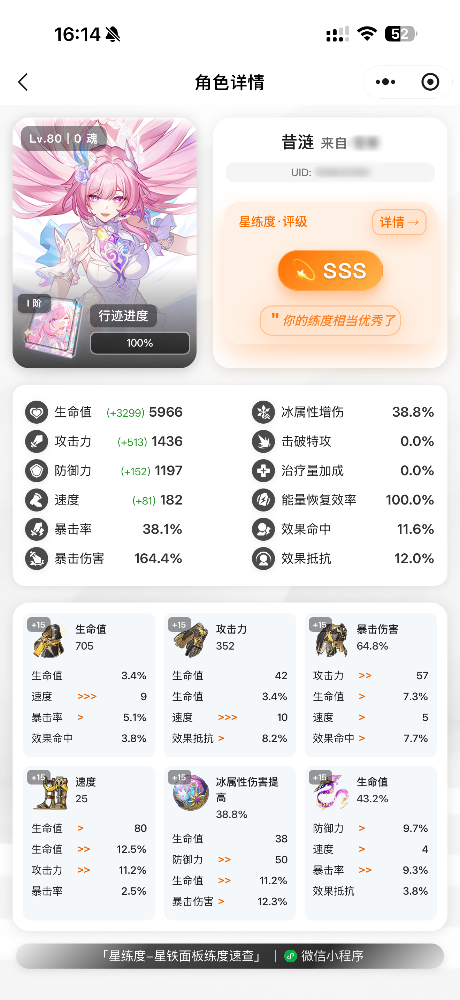

# 星练度-星铁面板练度速查

  
  **崩坏:星穹铁道角色评分小程序**

  

_现代化、无广告的角色养成评估工具,欣赏你的完美练度_

---

## 📲 立即使用

  
  ### 微信/QQ 扫码体验
  
  
  
  *开始收集你的角色吧！*
  

## 🌟 功能

<table>
<tr>
<td width="50%">

### 🎯 智能评分系统

- 多维度评分算法
- 词条价值智能分析
- 配装合理性评估

</td>
<td width="50%">

### 📊 数据可视化

- 清晰的属性面板展示
- 遗器配置详情
- 技能树进度追踪

</td>
</tr>
<tr>
<td width="50%">

### 🔄 便捷管理

- 支持多 UID 切换
- 数据快速同步
- 一键刷新数据

</td>
<td width="50%">

### 💎 角色全览

- 所有角色一览无余
- 快速切换角色详情
- 养成进度对比

</td>
</tr>
</table>

## 💡 优势

- ✨ **准确**: 基于游戏机制的科学评分算法
- 🚀 **快速**: 输入 UID 即可获取所有角色数据
- 🎨 **美观**: 纯净、现代化的 UI 设计
- 🔒 **安全**: 仅读取公开游戏数据,不涉及账号安全

## 📮 联系

遇到问题或有建议?
- 加入QQ群聊：1056385842
- 🐛 [提交 Bug](../../issues/new?labels=bug)
- 💡 [功能建议](../../issues/new?labels=enhancement)
- ⭐ 觉得好用?请给个 Star!

## 📄 许可协议

Copyright © 2024 StarGauge. All rights reserved.

本项目暂时采用私有协议。

---

  
  **Built with ❤️ for Trailblazers**
  
  *May this journey lead us starward* ⭐
  

